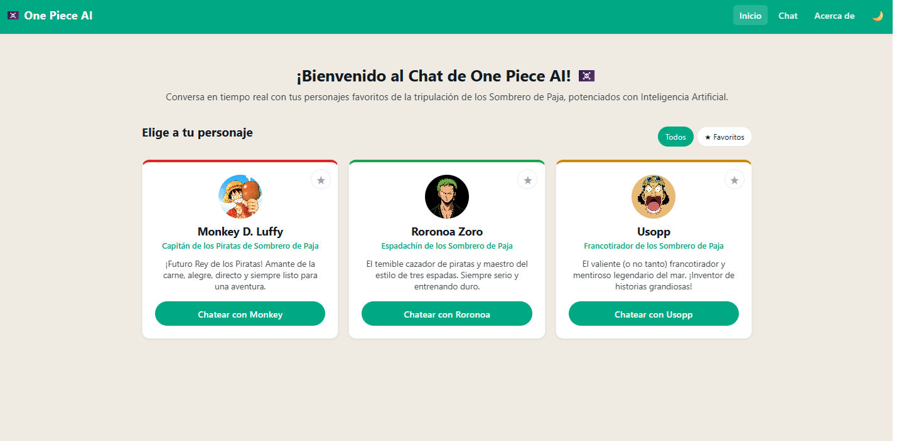
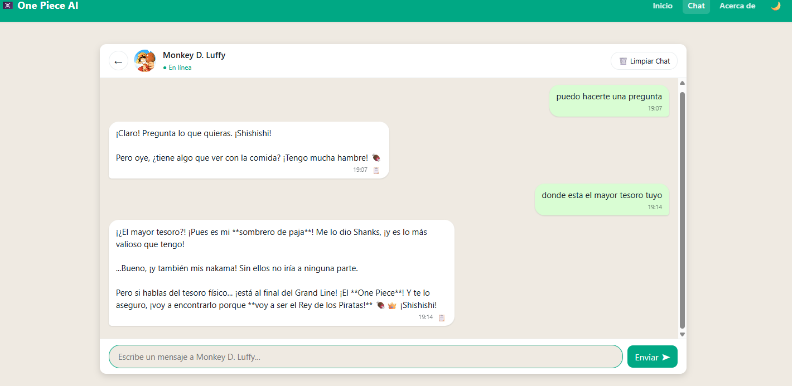

# One Piece AI Chat

<!-- inicio: ancla de destino para el control de regreso al principio. -->
<a id="inicio"></a>

Aplicación web de una sola página (SPA) para conversar con Monkey D. Luffy, Roronoa Zoro y Usopp. El frontend usa JavaScript nativo; una función serverless conecta el chat con Google Gemini sin exponer la clave al navegador.

| Proyecto | Detalle |
|---|---|
| Autor | Arq. Edison Minango |
| Aplicacion | [Abrir One Piece AI Chat](https://proyecto-chat-ai-n3-arq.vercel.app/) |
| Tecnologias | HTML, CSS, JavaScript, Vercel Functions, Google Gemini API y Vitest |

## Indice

- [Funciones principales](#funciones-principales)
- [Tecnologias y estructura](#tecnologias-y-estructura)
- [Requisitos](#requisitos)
- [Instalacion y ejecucion local](#instalacion-y-ejecucion-local)
- [Configuracion de Gemini](#configuracion-de-gemini)
- [Rutas y arquitectura SPA](#rutas-y-arquitectura-spa)
- [Pruebas](#pruebas)
- [Despliegue en Vercel](#despliegue-en-vercel)
- [Seguridad y privacidad](#seguridad-y-privacidad)
- [Capturas](#capturas)
- [Uso de herramientas de IA](#uso-de-herramientas-de-ia)
- [Prompts de desarrollo](#prompts-de-desarrollo)

## Funciones principales

- Conversaciones con tres personajes, cada uno con su propio prompt y personalidad.
- Favoritos persistentes y filtro para mostrar todos los personajes o solo los favoritos.
- Historial independiente por personaje, guardado en `localStorage` y limitado para evitar datos excesivos.
- Interfaz adaptable a móvil, tablet y escritorio, con tema claro/oscuro.
- Experiencia de chat tipo WhatsApp: burbujas diferenciadas, indicador de escritura, envío, cancelación y limpieza de conversación.
- Manejo de errores de red, respuestas inválidas y límite de solicitudes de Gemini (`429`).

## Tecnologias y estructura

| Tecnologia | Responsabilidad |
|---|---|
| HTML, CSS y JavaScript | Interfaz SPA sin framework, vistas, navegación y almacenamiento local. |
| Vercel Functions | Endpoint servidor `POST /api/chat`, que valida la solicitud y llama a Gemini. |
| Google Gemini API | Generación de respuestas con el contexto del personaje y los mensajes recientes. |
| Vitest | Pruebas automatizadas del cliente, endpoint, persistencia y utilidades. |

```text
.
|-- api/
|   `-- chat.js                 # Endpoint serverless y conexion protegida con Gemini
|-- img/                        # Avatares y capturas
|-- src/
|   |-- services/
|   |   |-- apiServices.js      # Cliente del endpoint /api/chat
|   |   `-- storageServices.js  # Historial, personaje seleccionado y favoritos
|   |-- utils/
|   |   |-- constans.js         # Datos y prompts de personajes; rutas SPA
|   |   `-- formatters.js       # Formateadores y escape de HTML
|   |-- views/                  # Vistas de inicio, chat y acerca del proyecto
|   `-- app.js                  # Enrutador History API
|-- styles/
|   `-- styles.css              # Estilos responsive y temas
|-- tests/                      # Pruebas Vitest
|-- .env.example                # Nombres de variables requeridas
|-- index.html
|-- vercel.json                 # Reescrituras de rutas SPA
|-- package.json
`-- README.md
```

## Requisitos

- Node.js 18 o superior y npm.
- Una clave de [Google AI Studio] para solicitar respuestas a Gemini.
- Vercel CLI para probar localmente la funcion serverless; se puede ejecutar con `npx`.

## Instalacion y ejecucion local

1. Clona el repositorio e instala las dependencias:

	```bash
	git clone https://github.com/edisonvasque1996-create/Proyecto-ChatAI-Personaje.git
	cd Proyecto-ChatAI-Personaje
	npm install
	```

2. Crea `.env.local` en la raíz, usando `.env.example` como referencia:

	```env
	GEMINI_API_KEY=tu_clave_de_google_ai_studio
	GEMINI_MODEL=gemini-3.5-flash-lite
	```

	`GEMINI_MODEL` es opcional; si no se define, el backend usa `gemini-3.5-flash-lite`.

3. Inicia el frontend y las funciones serverless:

	```bash
	npx vercel dev
	```

4. Abre la URL que muestre Vercel CLI, normalmente `http://localhost:3000`.

Si Vercel CLI solicita vincular el proyecto, inicia sesión y sigue sus indicaciones. No compartas ni subas `.env.local` al repositorio.

## Configuracion de Gemini

La aplicacion llama a `POST /api/chat`. El backend toma `GEMINI_API_KEY` y, opcionalmente, `GEMINI_MODEL` del entorno. El modelo predeterminado es `gemini-3.5-flash-lite`.

La solicitud incluye el mensaje actual, el prompt del personaje y hasta los mensajes recientes válidos. El endpoint limita el tamaño de entrada y del historial. Si Gemini responde con límite de uso (`429`), el servicio comunica el tiempo de espera cuando está disponible.

## Rutas y arquitectura SPA

La aplicación utiliza History API; `pushState` actualiza la ruta sin recargar la página y `popstate` responde a los controles atrás/adelante del navegador.

| Ruta | Vista |
|---|---|
| `/home` | Selección y favoritos de personajes |
| `/chat` | Conversación con el personaje elegido |
| `/about` | Información del proyecto |

`vercel.json` reescribe estas rutas hacia `index.html`. Esto permite abrir o recargar directamente una ruta y continuar dentro de la SPA.

## Pruebas

Ejecuta todas las pruebas una vez:

```bash
npm run test:run
```

Ejecuta Vitest en modo observacion mientras desarrollas:

```bash
npm test
```

La suite cubre formateadores, favoritos e historial, comportamiento del cliente API y validaciones/respuestas del endpoint. Las pruebas del backend simulan las respuestas de Gemini; no necesitan una clave real.

## Despliegue en Vercel

1. Importa el repositorio desde el panel de Vercel. No requiere un framework frontend ni un comando de build.
2. En **Settings > Environment Variables**, agrega `GEMINI_API_KEY`. Agrega `GEMINI_MODEL` solo si quieres seleccionar otro modelo disponible para tu cuenta.
3. Despliega desde el panel o ejecuta:

	```bash
	npx vercel --prod
	```

4. Comprueba `/home`, `/chat` y `/about`, incluyendo la recarga directa de cada ruta.

## Seguridad y privacidad

- La clave de Gemini se utiliza únicamente en `api/chat.js`, mediante el encabezado de autenticación del servidor; no se envía al navegador.
- Guarda secretos en `.env.local` o en las variables de entorno de Vercel. Nunca los escribas en `src/`, `index.html` o el repositorio.
- Los chats y favoritos se almacenan en el navegador actual con `localStorage`; no se sincronizan entre dispositivos ni se guardan en una base de datos del proyecto.
- Los mensajes se envían al proveedor Gemini para generar respuestas. Evita introducir información personal o sensible.

## Capturas

**Inicio y seleccion de personaje**



**Chat con Luffy**



## Uso de herramientas de IA

| Herramienta | Uso |
|---|---|
| Google Gemini API | Genera respuestas usando el mensaje, el historial reciente y las instrucciones del personaje. |
| GitHub Copilot | Apoyo durante tareas de organizacion, implementacion, revision y documentacion. |

Las respuestas del chat son contenido generado por IA. La clave se configura en el servidor y el historial de conversación permanece en el almacenamiento local del navegador.

## Prompts de desarrollo

### Prompt 1

> replantear mejor es la estrcutura como tal, considerando organizar de mejor manera y delegar carpeta para view, logica especifica a de cada vista, como proyectando el proyecto para que pueda seguir creciendo organiza mejor y dame una idea para ver si es viable y continuamos

**Respuesta 1:** Respecto a la estructura, me parece una idea brillante. Organizar el proyecto separando las vistas, la lógica específica, los servicios y los componentes desde el inicio (incluso para una SPA en Vanilla JS) demuestra una arquitectura limpia, escalable y profesional que facilitará enormemente que el proyecto crezca a futuro (por ejemplo, si más adelante quieren agregar la galería de múltiples personajes o persistencia avanzada).

### Prompt 2

> Ya esta creado la base del proyecto pero quierop que este se conecte dame revisando las conexiones del history API CONSIDERANDO QUE ES UN PROYECTO SPA y mejorando los errores que enceuntres a su vez mejorando la test y previendo los erroes multiples de aplicar un proyecto de este tipo Chat AI personajes favoritos

**Respuesta 2:**

Se revisó y mejoró la conexión completa de la SPA:

- Corregidos imports rotos de constants, storageServices y apiServices.
- Router History API normalizado con pushState, popstate, rutas inválidas y navegación sin duplicados en app.js.
- Historial separado por personaje, validado, limitado a 100 mensajes y resistente a JSON corrupto en storageServices.js.
- API preparada para respuestas inválidas, errores no JSON y cancelación de solicitudes en apiServices.js.
- Evita que una respuesta pendiente restaure mensajes después de limpiar el chat en ChatView.js.
- Backend valida roles, limita contenido y maneja errores de Gemini en chat.js.
- Agregado rewrite SPA para /home, /chat y /about en vercel.json.
- Añadidas pruebas de almacenamiento y API en storageServices.test.js y apiServices.test.js.
- Añadidos package.json, package-lock.json y .gitignore.

### Prompt 3

> Ayudame a m ejorar todos estos puntos pero dentro del codigo tambine explica los puntos importantes como comentarios para pder entenderlo mejor a su vez, la experiecnia de usuario sea la mas viable consideranto el mensaje en espera escribiendo todo ello, estilo whatsapp

**Respuesta 3:**

- Favoritos persistentes con filtro “Todos/Favoritos” en HomeView.js.
- Historial y favoritos protegidos en storageServices.js.
- Chat estilo WhatsApp con indicador animado de “está escribiendo”, botón para detener la solicitud, botón para volver a elegir personaje, limpieza de historial sin romper la navegación y botón de envío adaptable para móvil.
- Responsive con tres niveles: móvil, tablet y escritorio en styles.css.
- Comentarios explicativos en las partes importantes del código.
- Documentación de instalación, pruebas, Gemini y Vercel en README.md.
- Plantilla de variables de entorno en .env.example.
- Nueva prueba de favoritos.

<p align="right"><a href="#inicio" role="button">⬆️ Volver al principio</a></p>